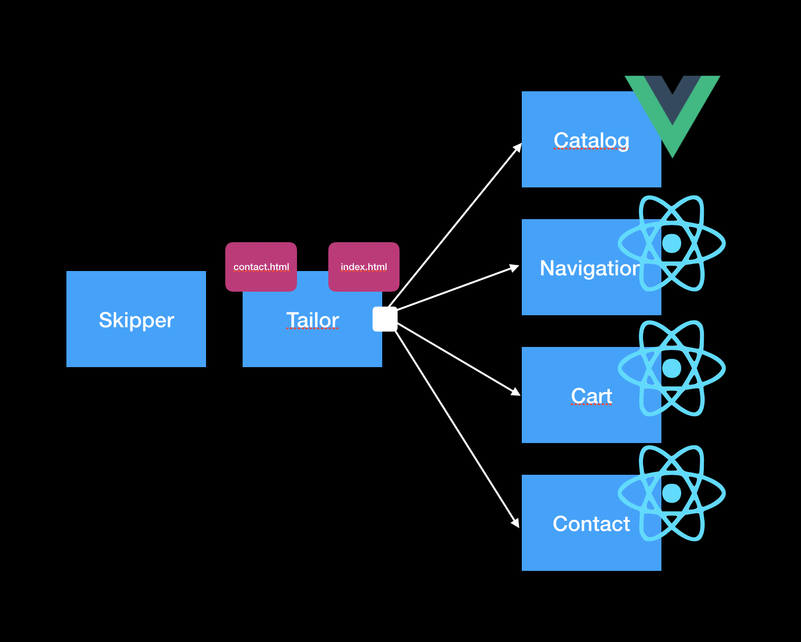

## Moasic 9 Stack Example

Simple Show-Case for Mosaic9 with different Backends and Frameworks (React + VueJS)

## Build

Install webpack and webpack-cli globally
```
run build-all.sh
```

This will build all artifacts and the corresponding docker images.

Every project contains a build.sh that _knows_ how to build the artifact.

## Architecture



## Intercomponent Communication

For Inter-Component Communication the System uses [_eev_](https://github.com/chrisdavies/eev)

In Catalog:
```
methods: {
    addToCart(article){
      this.eev.emit('add-cart-item', {
              'name': article.name,
              'price': article.price
            })
    }
  },
```

In Cart:

```
props.eev.on('add-cart-item', addItem);
```

## Setup

Add the following entries to yours hostsfile, if you start each services manually.

```
127.0.0.1 cart
127.0.0.1 catalog
127.0.0.1 navi
127.0.0.1 contact
```